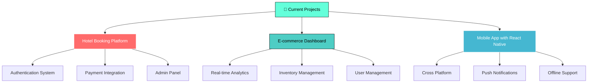

# <div align="center">✨ Sayan Chatterjee ✨</div>

<div align="center">
  
</div>

<div align="center">
  
</div>

---

## 🌟 About Me

<div align="center">
  
</div>

```javascript
const sayan = {
    name: "Sayan Chatterjee",
    role: "Full-Stack Developer",
    location: "West Bengal, India 🇮🇳",
    languages: ["JavaScript", "TypeScript", "VB.NET", "HTML", "CSS"],
    frameworks: ["React", "Next.js", "Tailwind CSS", "Framer Motion"],
    databases: ["MySQL", "PostgreSQL", "MongoDB"],
    tools: ["Git", "VS Code", "Figma", "Postman"],
    currentFocus: "Building scalable web applications",
    funFact: "I debug with console.log() and I'm proud of it! 😄",
    
    getCurrentStatus: function() {
        return "Crafting beautiful user experiences ✨";
    },
    
    getMotivation: function() {
        return "Code is poetry written in logic 🎭";
    }
};
```

<div align="center">
  
</div>

---

## 🛠️ Tech Arsenal

<div align="center">

### **Frontend Mastery**


### **Backend & Database**


### **Tools & Platforms**


### **Languages & Frameworks**


</div>

<div align="center">
  
</div>

---

## 🚀 Featured Projects

<table>
  <tr>
    <td width="50%">
      <h3 align="center">🏨 Luxury Hotel Platform</h3>
      <div align="center">
        
        <br><br>
        <p><strong>🔥 Modern hotel booking platform with cutting-edge features</strong></p>
        <p>• JWT Authentication & Token Security 🔐</p>
        <p>• Responsive Design & Smooth Animations ✨</p>
        <p>• Payment Gateway Integration 💳</p>
        <p>• Real-time Booking System 📅</p>
        <br>
        
        
        
        
      </div>
    </td>
    <td width="50%">
      <h3 align="center">🍕 Smart Food Ordering</h3>
      <div align="center">
        
        <br><br>
        <p><strong>⚡ Lightning-fast food delivery application</strong></p>
        <p>• Real-time Order Tracking 🚚</p>
        <p>• Interactive Menu with Filters 🔍</p>
        <p>• Payment Integration 💰</p>
        <p>• Push Notifications 📱</p>
        <br>
        
        
        
        
      </div>
    </td>
  </tr>
  <tr>
    <td width="50%">
      <h3 align="center">☕ Coffee Shop POS</h3>
      <div align="center">
        
        <br><br>
        <p><strong>💼 Advanced Point-of-Sale System</strong></p>
        <p>• Inventory Management 📦</p>
        <p>• Sales Analytics Dashboard 📊</p>
        <p>• Automated Billing 🧾</p>
        <p>• Multi-user Support 👥</p>
        <br>
        
        
        
        
      </div>
    </td>
    <td width="50%">
      <h3 align="center">🌐 Portfolio Website</h3>
      <div align="center">
        
        <br><br>
        <p><strong>🎨 Interactive Personal Portfolio</strong></p>
        <p>• 3D Animations & Effects 🎭</p>
        <p>• Dark/Light Theme Toggle 🌓</p>
        <p>• Responsive Design 📱</p>
        <p>• Contact Form Integration 📧</p>
        <br>
        
        
        
        
      </div>
    </td>
  </tr>
</table>

---

## 📊 GitHub Analytics

<div align="center">
  
  
</div>

<div align="center">
  
</div>

<div align="center">
  
</div>

---

## 🎯 Current Focus

<div align="center">



</div>

---

## 🌱 Learning Journey

<div align="center">

| Technology | Progress | Next Goal |
|------------|----------|-----------|
| **React/Next.js** | ████████████████████ 100% | Advanced Patterns |
| **TypeScript** | ████████████████░░░░ 80% | Advanced Types |
| **Node.js** | ██████████████░░░░░░ 70% | Microservices |
| **Python** | ████████████░░░░░░░░ 60% | Machine Learning |
| **React Native** | ██████████░░░░░░░░░░ 50% | Production App |
| **DevOps** | ████████░░░░░░░░░░░░ 40% | Docker & K8s |

</div>

---

## 💡 Philosophy & Quotes

<div align="center">
  
</div>

> ### 🎭 *"Code is like humor. When you have to explain it, it's bad."* — Cory House

<div align="center">

**My Development Principles:**
- 🔥 **Clean Code** - Write code that tells a story
- ⚡ **Performance** - Every millisecond matters
- 🎨 **User Experience** - Design with empathy
- 🛡️ **Security** - Trust is everything
- 📚 **Continuous Learning** - Stay curious, stay growing

</div>

---

## 🏆 Achievements & Certifications

<div align="center">

<table>
  <tr>
    <td align="center" width="25%">
      
      <br><strong>Open Source Contributor</strong>
      <br><em>10+ repositories</em>
    </td>
    <td align="center" width="25%">
      
      <br><strong>50+ Projects</strong>
      <br><em>Web & Mobile Apps</em>
    </td>
    <td align="center" width="25%">
      
      <br><strong>99% Rating</strong>
      <br><em>Happy Clients</em>
    </td>
    <td align="center" width="25%">
      
      <br><strong>A+ Grade</strong>
      <br><em>Clean Architecture</em>
    </td>
  </tr>
</table>

</div>

---

## 📬 Let's Connect & Collaborate

<div align="center">

### 🌐 **Find me across the internet**

<a href="mailto:sayanchatterjee@example.com">
  
</a>
<a href="https://linkedin.com/in/yourprofile">
  
</a>
<a href="https://yourwebsite.com">
  
</a>
<a href="https://twitter.com/yourhandle">
  
</a>
<a href="https://instagram.com/yourhandle">
  
</a>

</div>

<div align="center">

### 💬 **Let's build something amazing together!**

**I'm always open to:**
- 🚀 Exciting project collaborations
- 💼 Freelance opportunities  
- 🎓 Mentoring & knowledge sharing
- ☕ Virtual coffee chats about tech

</div>

---

## 🎮 Fun Section

<div align="center">

### 🎵 **Currently Vibing To**
[](https://open.spotify.com/user/yourspotifyusername)

### 🎲 **Random Dev Joke**


### 🐍 **Snake Game (My Contribution Graph)**


### 📈 **Visitor Count**


</div>

---

<div align="center">
  
</div>

<div align="center">

### ⭐ **Thank you for visiting!** ⭐
**If you like what you see, don't forget to star ⭐ my repositories!**

 **Happy Coding!** 

---

*Made with ❤️ and lots of ☕ by Sayan Chatterjee*

</div>
